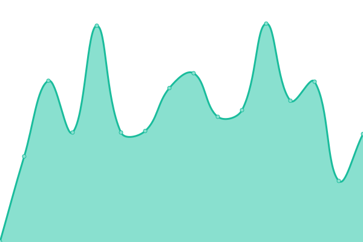

# [📈 Live Status](https://upptime.github.io/upptime): <!--live status--> **🟩 All systems operational**

This repository contains the open-source uptime monitor and status page for [Upptime](https://upptime.js.org), powered by [Upptime](https://github.com/upptime/upptime).

With [Upptime](https://upptime.js.org), you can get your own unlimited and free uptime monitor and status page, powered entirely by a GitHub repository. We use [Issues](https://github.com/upptime/upptime/issues) as incident reports, [Actions](https://github.com/next-franciscocalle/openweb-uptime/actions) as uptime monitors, and [Pages](https://upptime.github.io/upptime) for the status page.

<!--start: status pages-->
<!-- This summary is generated by Upptime (https://github.com/upptime/upptime) -->
<!-- Do not edit this manually, your changes will be overwritten -->
<!-- prettier-ignore -->
| URL | Status | History | Response Time | Uptime |
| --- | ------ | ------- | ------------- | ------ |
|  [Accionistas e Inversores (es)](https://accionistaseinversores.bbva.com/) | 🟩 Up | [accionistas-e-inversores-es.yml](https://github.com/BBVA-Openweb/uptime-sites/commits/HEAD/history/accionistas-e-inversores-es.yml) | 

 590ms
     
 | 

<a href="https://uptime.openweb.bbva/history/accionistas-e-inversores-es">100.00%</a>
    

|  [Accionistas e Inversores (en)](https://shareholdersandinvestors.bbva.com/) | 🟩 Up | [accionistas-e-inversores-en.yml](https://github.com/BBVA-Openweb/uptime-sites/commits/HEAD/history/accionistas-e-inversores-en.yml) | 

 691ms
     
 | 

<a href="https://uptime.openweb.bbva/history/accionistas-e-inversores-en">100.00%</a>
    

|  [BBVA IT Spain](https://www.bbvaitspain.com) | 🟩 Up | [bbva-it-spain.yml](https://github.com/BBVA-Openweb/uptime-sites/commits/HEAD/history/bbva-it-spain.yml) | 

 1282ms
     
 | 

<a href="https://uptime.openweb.bbva/history/bbva-it-spain">100.00%</a>
    

|  [BBVA.com](https://www.bbva.com) | 🟩 Up | [bbva-com.yml](https://github.com/BBVA-Openweb/uptime-sites/commits/HEAD/history/bbva-com.yml) | 

 957ms
     
 | 

<a href="https://uptime.openweb.bbva/history/bbva-com">100.00%</a>
    

|  [Fundación BBVA](https://www.fbbva.es/) | 🟩 Up | [fundacion-bbva.yml](https://github.com/BBVA-Openweb/uptime-sites/commits/HEAD/history/fundacion-bbva.yml) | 

 732ms
     
 | 

<a href="https://uptime.openweb.bbva/history/fundacion-bbva">100.00%</a>
    

|  [OpenMind](https://www.bbvaopenmind.com/) | 🟩 Up | [open-mind.yml](https://github.com/BBVA-Openweb/uptime-sites/commits/HEAD/history/open-mind.yml) | 

 862ms
     
 | 

<a href="https://uptime.openweb.bbva/history/open-mind">100.00%</a>
    

|  [Research](https://www.bbvaresearch.com/) | 🟩 Up | [research.yml](https://github.com/BBVA-Openweb/uptime-sites/commits/HEAD/history/research.yml) | 

 443ms
     
 | 

<a href="https://uptime.openweb.bbva/history/research">100.00%</a>
    

<!--end: status pages-->

[**Visit our status website →**](https://upptime.github.io/upptime)

## 📄 License

- Powered by: [Upptime](https://github.com/upptime/upptime)
- Code: [MIT](./LICENSE) © [Upptime](https://upptime.js.org)
- Data in the `./history` directory: [Open Database License](https://opendatacommons.org/licenses/odbl/1-0/)
